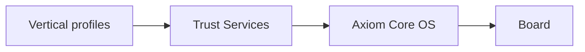

<!-- Axiom OS — public org landing -->
<p align="center">
  
</p>

<p align="center">
  
</p>

<h1 align="center">Axiom OS</h1>

<p align="center">
  <strong>Cryptographically verifiable embedded Linux</strong><br/>
  for safety-critical edge systems
</p>

<p align="center">
  <a href="LICENSE"></a>
  
  
  
</p>

<p align="center">
  Open-core <strong>companion OS</strong> — not PX4 / ArduPilot.<br/>
  Sits beside the vehicle stack. Enforces integrity on boot, commands, audit, and updates.<br/>
  First vertical: <strong>UAV</strong>.
</p>

<p align="center">
  <a href="mailto:research@axiom-os.io"><strong>research@axiom-os.io</strong></a>
  ·
  <a href="https://github.com/axiomos-uav">github.com/axiomos-uav</a>
</p>

<p align="center">
  
</p>

<details>
<summary><strong>ASCII mark</strong> (optional)</summary>

```
    .  .     .     ..         .           .    .    .      '.            .     .
             .   ...              .                         ...     .          .
.. .   .   .    ...'                      .       .     .   '.....       .      
    .         .....                .                        ......'             
.     .    ........   .       .   . ...  '.'      .         ........            
          .........           .........  '.......            ........        .  
         ...........           '.......  '......'         .  ..........         
       ...............         '.......  '......'        .  ............' .     
   .  ......................'..'.......  '......' .......................'      
 .   ..........................'....... .'......' .........................     
    ...........................'.......  '......' ..........................    
  .............................'.......  '......'............................'  
 ..............................'......    '.....' ............................' 
...'        .'................ ...    '  '`  .'.' ................'         ...'
    .          ..............     ....'  ......    ..............    .. .       
                .............'........'  .........' '...........   .      ..    
   .   .       '......................'  .......'................            . .
              '.............  . ......'  .......    ..............              
   .          ...........'      ......' ........      `...........              
.        .   ............   .   ......'  .......       '...........'            
.. '      .............'        ......'  .......     . . .............  .   .   
    ..................          .......  ....... .        ..................    
    .................          ........  .......         . '..............'     
       ............'  .   .     .......  .......            '............ .     
       .`..........             ........ .......  .           .........'        
          ........' .           .......  ....... .            ........          
            .......             ........ .......       .     ........           
     .    .  .......     .     ........  .......     .      '.......            
       ..      .....       . .  .......  .......            '.....     .        
 .              '.... .         .......  ........           .... .              
                  ...           ....... ........           ...' .       .       
.                  ..'       .  .......  .......  .    .   .'          .  ..    
       .      .      '           ......  '.....  .      . '              .      
     .           .                '....  '...'.                          .    . 
 .        .  .          .           ...  '..                   .                
            . .   .      .            .  '.      .                              
```

</details>

## Why it exists

<table>
<tr>
<td width="33%" valign="top">

**Supply chain**  
Rootfs library rewritten before shipment. No runtime block check on vanilla embedded Linux.

</td>
<td width="33%" valign="top">

**Command injection**  
MAVLink and peers accept spoofed or replayed control. No OS-level authenticity.

</td>
<td width="33%" valign="top">

**Log forgery**  
Post-incident records editable by the operator. Third parties cannot prove completeness.

</td>
</tr>
</table>

Axiom answers with four properties — **fail-closed**.

<p align="center">
  
</p>

## Four properties

| | Property | Mechanism | Ship rule |
|---|----------|-----------|-----------|
| **P1** | Firmware / boot integrity | dm-verity + signed FIT (**U-Boot**) | Fail-closed |
| **P2** | Command authenticity | `axsign` Ed25519 + monotonic nonce | Fail-closed |
| **P3** | Audit completeness | `axld` Merkle + ledger + `axverify` | Tamper detectable |
| **P4** | Update integrity | `axota` registry + manufacturer signature | Rogue rejected |

```text
axkey → P1 → axsign → axld / axverify → axota → vertical → Console
```

Softkey = **lab only**. Production needs hardware-backed keys. No unsigned command paths. No ungated OTA.

## Platform



| Layer | Role |
|-------|------|
| Board | Yocto machine + BSP |
| Core OS | `DISTRO=axiom` · U-Boot · signed FIT · dm-verity |
| Trust Services | Rust daemons |
| Verticals | Protocol bridges + compliance config |

### Trust Services

| Daemon | One line |
|--------|----------|
|  `axkey` | Key backend — softkey in lab; TPM / TrustZone planned for prod |
| `axsign` | Protocol auth — unsigned / replayed dropped |
| `axld` | Merkle over events — optional ledger anchor |
| `axota` | Hash registry + manufacturer signature before install |
| `axverify` | Prove a log matches its anchors |
| `axctl` | Operator CLI |

Unix-socket IPC. Frozen contracts. Port traits keep adapters swappable.

## Boot

**U-Boot + signed FIT + dm-verity** — not GRUB.

1. Board firmware loads U-Boot  
2. U-Boot verifies **RSA-signed FIT**  
3. FIT carries dm-verity bootargs (signed with the image)  
4. Bad / unsigned FIT → **no login**

`axsign` = Ed25519. FIT = U-Boot RSA.

## Verticals & boards

<table>
<tr>
<td width="50%" valign="top">

| Profile | Focus | Status |
|---------|-------|--------|
| `axiom-uav` | MAVLink, U-space | **Active** |
| `axiom-robotics` | ROS 2 / CAN | On demand |
| `axiom-energy` | Modbus / DNP3 | Planned |
| `axiom-defence` | Air-gapped ledger | Planned |
| Aerospace / appliance | Whitepaper | Horizon |

</td>
<td width="50%" valign="top">

| Machine | Status |
|---------|--------|
| QEMU `qemuarm64` | Lab / CI |
| Raspberry Pi 4 / CM4 | Primary HW |
| Jetson, i.MX8, … | Later BSP |

</td>
</tr>
</table>

## Status

Scaffolding ≠ production.

| Gate | Meaning | Now |
|------|---------|-----|
| **A** | QEMU · P1 · Trust Services · SEC · UAV demo | Done (lab softkey) |
| **B** | CM4 metal flash + re-prove | In progress |
| **C** | TPM / HW key · softkey banned · live ledger | Not started |
| **D–F** | Eval kit · commercial · defence | Scaffold |

**Phase 1 exit = A + B + C.**

This repo is the **public org page**. Engineering source is not published here. Partners and Community Edition follow the roadmap — [research@axiom-os.io](mailto:research@axiom-os.io).

<p align="center">
  
</p>

## Three-year roadmap

Targets from late 2026 — not shipped claims.

<table>
<tr>
<td width="33%" valign="top">

### Year 1 · 2027  
**Foundation**

Close Phase 1:

- CM4 evidence  
- P1 on metal  
- Live ledger + `axverify`  
- MAVLink + `axota` on device  
- U-space tags  
- Prod keys; softkey off  

</td>
<td width="33%" valign="top">

### Year 2 · 2028  
**Commercial**

- Jetson + HW key backend  
- Console v0.1  
- `axctl` image flow  
- Third-party audit  
- First OEM pilot  
- Community Edition  

</td>
<td width="33%" valign="top">

### Year 3 · 2029  
**Assurance**

- Energy + defence profiles  
- Air-gap ledger · MLS · FIPS *alignment*  
- IEC 62443-4-2 started  
- Console v1  

</td>
</tr>
</table>

**Horizon:** aerospace / security-appliance profiles · post-quantum command signatures · machine-checked audit proofs.

---

<p align="center">
  
</p>

<p align="center">
  Report P1–P4 flaws <strong>privately</strong> — not in public issues.<br/>
  Copyright 2026 Axiom OS Project · Apache License 2.0
</p>
